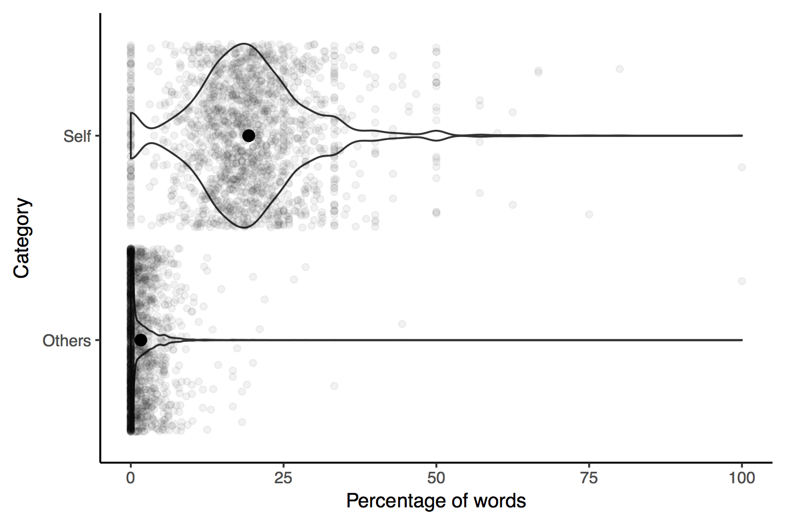

# simpleNLP

Natural language processing workflows built on the tidytext package. 

Visualizations using ggplot2. 

Includes three dictionaries (emotions, valence, relational terms) and an example dataset (comments on a reddit.com/r/askreddit thread on surviving a suicide attempt).

## Author

Ian Hussey (ian.hussey@ugent.be)

## License

GPLv3+

## Installation 

```r
library(devtools)
install_github("ianhussey/NLP")
library(NLP)
```

### Usage

See `vignettes/usage.Rmd` for example workflows.

Example plot:



## To do

- Are apostrophes removed by the script or not? Does the dict require them for matching or not? Make sure these two match up. 